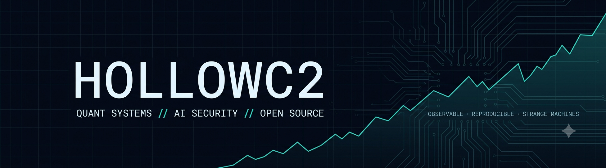

<picture>
  <source media="(prefers-color-scheme: dark)" srcset="./assets/banner-dark.png">
  <source media="(prefers-color-scheme: light)" srcset="./assets/banner-light.png">
  
</picture>

### Quant systems • AI security • open-source tools • robotics

Building automated trading infrastructure, LLM security tools, self-hosted services, and occasionally things with motors.

## Featured projects

### 🦋 ButterflyGuy
Automated SPX 0-DTE research and trading infrastructure.

### 🛡️ Aegis-ML
OpenAI-compatible firewall for prompt injection, PII, and audit logging.

### 🧾 PDFBillr
Self-hosted PDF invoice generator in one Docker container.

### 🚀 StompRocket
Interactive showcase for 3D-printable stomp rockets.

## Current work

- Improving strategy validation and execution safety
- Building agent-assisted development workflows
- Experimenting with robotics and embedded systems

## Stack

Python · TypeScript · Rust · Docker · Linux · FastAPI · PostgreSQL

Billy Bitcoin

I like systems that are observable, reproducible, and a little bit strange. 🤑

